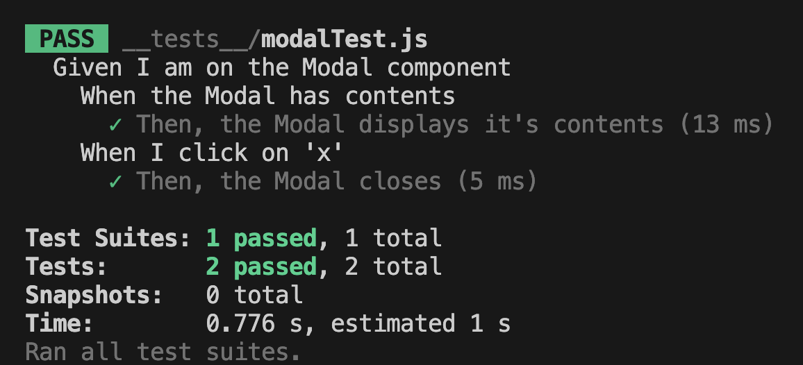

# ai-react-modal, a modal component for React

A library of React component created using `create-react-app`.

## Installation Section

Install `ai-react-modal` using npm:

```
npm install ai-react-modal
```

## Usage Section

### Add to your React project

Example for using the `Modal` component:

```js
import React, { useState } from "react";
import Modal from "ai-react-modal";
import "ai-react-modal/modal.css";

function App() {
	const [isOpen, setIsOpen] = useState(false);
	return (
		<div>
			<button onClick={() => setIsOpen(true)}>Open Modal</button>
			<Modal
				isOpen={isOpen}
				onClose={() => setIsOpen(false)}
				title="Modal Title goes here"
				content={<p>Modal contents go here.</p>}
				buttonLabel="Close"
                icon={ /* Custom icon */ }
				style={{
                    modal: { /* Custom styles for modal container */ },
				    body: { /* Custom styles for modal body */ },
				    title: { /* Custom styles for title */ },
				    button: { /* Custom styles for close button */ },
				}}
			/>
		</div>
	);
}

export default App;
```

### Props details

- **isOpen**: Boolean that controls visibility of the modal.
- **onClose**: Function to call for closing the modal.
- **title**: String for the modal's title.
- **content**: String for the modal's content.
- **buttonLabel**: String for the close button text.
- **icon**: Optional custom icon.
- **style**: Optional inline styling (modal, body, title and button properties).

## Jest Tests

Run the Jest tests using npm:
`npm test`


## Features Section

- **Lightweight**: A minimalistic approach ensures that the modal doesn't add unnecessary bloat to your project.
- **Simplicity**: Designed with ease of use in mind, making it straightforward to integrate into any React project.
- **Styling Included**: Comes with a default CSS file that provides a sleek and modern design out-of-the-box, while also allowing for easy customization.
- **Customizable**: Offers a range of props for customization, allowing you to adjust the appearance and behavior of the modal to fit your needs.
- **React-Friendly**: Seamlessly integrates with React projects, maintaining consistency with React best practices and patterns.

## Author

Alex I.

## License

MIT license

## Keywords

react
modal
component
